# 👋 Hi, I'm Khalid Ashani

### 📈 Aspiring Data Analyst in Finance | ML Enthusiast | 🏃‍♂️ Runner
**"1% better each day."** I am a data-driven professional focused on leveraging **Python** and **Machine Learning** to solve complex financial problems. Currently, I am specializing in **Anomaly Detection within Data Warehousing** to identify patterns that others might miss.

---

### 🚀 What I'm Working On
- **🔍 Anomaly Detection:** Building ML models to detect outliers and irregularities in large-scale data warehouses.
- **🌐 Web Diversification:** Developing my [Portfolio Website](https://www.khalidashani.com) from scratch using **HTML, CSS, and JS** to better understand the full lifecycle of data presentation.
- **📊 Finance Analytics:** Exploring how predictive modeling can optimize financial decision-making.

### 🛠 My Tech Stack
| Category | Tools & Technologies |
| :--- | :--- |
| **Data Science** | Python, Pandas, NumPy, Scikit-Learn, Matplotlib, Seaborn |
| **Web Dev** | HTML5, CSS3, JavaScript (Vanilla) |
| **Tools** | Git, GitHub Pages, Jupyter Notebooks, Data Warehousing |

### 📂 Featured Repositories
* **[Python](https://github.com/khalidashani/Python):** A collection of Jupyter Notebooks and library tutorials focused on ML and Data Analysis.
* **[Portfolio](https://github.com/khalidashani/portfolio):** The source code for my personal website where I document my coding and running progress.

---

### 🏃‍♂️ Beyond the Code
I believe the discipline required for long-distance running mirrors the discipline required for clean code. I track my running progress as a testament to my motto: **1% better each day.** Whether it's a faster split or a cleaner function, I'm always moving forward.

### 📫 Let's Connect
- **Portfolio:** [khalidashani.com](https://www.khalidashani.com)
- **LinkedIn:** [Khalid Ashani](https://my.linkedin.com/in/khalid-ashani-2a6a70213)
- **Instagram:** [@khalidashani](https://www.instagram.com/khalidashani)
---
### 🧠 Skills & Tools

#### 🐍 Python Stack (Data Science & ML)

#### 📊 R & Statistical Analysis

#### 🗃️ Databases & Big Data

#### 🌐 Web Development (Portfolio Stack)

---
### 📊 GitHub Stats

